# 🚀 部署到 GitHub Pages 完整指南

## 📋 目录

1. [前置准备](#前置准备)
2. [配置 SSH 密钥](#配置-ssh-密钥)
3. [推送代码到 GitHub](#推送代码到-github)
4. [自动部署流程](#自动部署流程)
5. [手动部署方法](#手动部署方法)
6. [常见问题](#常见问题)

---

## 前置准备

### 1. 确认仓库结构

你需要两个 GitHub 仓库：

- **源码仓库**: 存放 Mizuki 博客源代码（当前仓库）
- **Pages 仓库**: `dandingbobaishi.github.io` - 存放构建后的静态文件

### 2. 检查分支

- 源码仓库默认分支：`master`
- Pages 仓库部署分支：`main`

---

## 配置 SSH 密钥

### 步骤 1: 生成 SSH 密钥对

在本地终端运行：

```bash
# 生成新的 SSH 密钥对（不要设置密码）
ssh-keygen -t rsa -b 4096 -C "your_email@example.com" -f mizuki-deploy-key -N ""
```

这会生成两个文件：
- `mizuki-deploy-key` - 私钥
- `mizuki-deploy-key.pub` - 公钥

### 步骤 2: 配置 Pages 仓库（公钥）

1. 打开 https://github.com/dandingbobaishi/dandingbobaishi.github.io
2. 进入 **Settings** → **Deploy keys**
3. 点击 **Add deploy key**
4. 配置：
   - **Title**: `MIZUKI_DEPLOY_KEY`
   - **Key**: 粘贴 `mizuki-deploy-key.pub` 的内容
   - ✅ 勾选 **Allow write access**
5. 点击 **Add key**

### 步骤 3: 配置源码仓库（私钥）

1. 打开你的源码仓库（当前仓库）
2. 进入 **Settings** → **Secrets and variables** → **Actions**
3. 点击 **New repository secret**
4. 配置：
   - **Name**: `DEPLOY_KEY`（必须是这个名字）
   - **Secret**: 粘贴 `mizuki-deploy-key` 的内容（私钥）
5. 点击 **Add secret**

⚠️ **重要**: 私钥添加后，立即删除本地的密钥文件以确保安全：

```bash
rm mizuki-deploy-key mizuki-deploy-key.pub
```

---

## 推送代码到 GitHub

### 方法 1: 使用 Git 命令（推荐）

```bash
# 1. 进入 mizuki 目录
cd mizuki

# 2. 初始化 Git（如果还没有）
git init

# 3. 添加远程仓库
git remote add origin https://github.com/你的用户名/你的源码仓库.git

# 4. 添加所有文件
git add .

# 5. 提交更改
git commit -m "Add enhanced features and styles"

# 6. 推送到 GitHub
git push -u origin master
```

### 方法 2: 使用 GitHub Desktop

1. 打开 GitHub Desktop
2. 选择 **File** → **Add Local Repository**
3. 选择 `mizuki` 目录
4. 填写提交信息
5. 点击 **Commit to master**
6. 点击 **Push origin**

### 方法 3: 使用 VS Code

1. 打开 VS Code 的源代码管理面板（Ctrl+Shift+G）
2. 点击 **Initialize Repository**
3. 暂存所有更改（点击 + 号）
4. 输入提交信息
5. 点击 **Commit**
6. 点击 **Publish Branch**

---

## 自动部署流程

### 工作原理

```mermaid
graph LR
    A[本地修改代码] --> B[git push]
    B --> C[GitHub Actions 触发]
    C --> D[安装依赖]
    D --> E[构建项目 pnpm build]
    E --> F[生成 dist/ 目录]
    F --> G[部署到 Pages 仓库]
    G --> H[网站自动更新]
```



### 触发条件

当你推送代码到 `master` 分支时，GitHub Actions 会自动：

1. ✅ 检出源代码
2. ✅ 安装 Node.js 18.x
3. ✅ 安装 pnpm 10.22.0
4. ✅ 安装项目依赖
5. ✅ 构建静态文件（`pnpm run build`）
6. ✅ 部署到 `dandingbobaishi.github.io` 仓库

### 查看部署状态

1. 打开你的源码仓库
2. 点击 **Actions** 标签
3. 查看最新的工作流运行状态

---

## 手动部署方法

如果自动部署失败，可以手动部署：

### 步骤 1: 本地构建

```bash
cd mizuki
pnpm install
pnpm run build
```

### 步骤 2: 部署到 GitHub Pages

```bash
# 进入构建目录
cd dist

# 初始化 Git
git init
git add -A
git commit -m 'Deploy'

# 推送到 Pages 仓库
git push -f https://github.com/dandingbobaishi/dandingbobaishi.github.io.git master:main

# 返回上级目录
cd ..
```

---

## 快速部署脚本

### Windows 用户

创建 `deploy.bat` 文件：

```batch
@echo off
echo ========================================
echo   Mizuki 博客部署脚本
echo ========================================
echo.

REM 进入 mizuki 目录
cd mizuki

echo [1/4] 安装依赖...
call pnpm install
if errorlevel 1 (
    echo [错误] 依赖安装失败
    pause
    exit /b 1
)

echo.
echo [2/4] 构建项目...
call pnpm run build
if errorlevel 1 (
    echo [错误] 构建失败
    pause
    exit /b 1
)

echo.
echo [3/4] 提交代码...
git add .
git commit -m "Update blog: %date% %time%"

echo.
echo [4/4] 推送到 GitHub...
git push origin master

echo.
echo ========================================
echo   部署完成！
echo   GitHub Actions 将自动构建并部署
echo   请访问: https://dandingbobaishi.github.io/
echo ========================================
pause
```

### Linux/Mac 用户

创建 `deploy.sh` 文件：

```bash
#!/bin/bash

echo "========================================"
echo "  Mizuki 博客部署脚本"
echo "========================================"
echo

cd mizuki

echo "[1/4] 安装依赖..."
pnpm install || { echo "[错误] 依赖安装失败"; exit 1; }

echo
echo "[2/4] 构建项目..."
pnpm run build || { echo "[错误] 构建失败"; exit 1; }

echo
echo "[3/4] 提交代码..."
git add .
git commit -m "Update blog: $(date)"

echo
echo "[4/4] 推送到 GitHub..."
git push origin master

echo
echo "========================================"
echo "  部署完成！"
echo "  GitHub Actions 将自动构建并部署"
echo "  请访问: https://dandingbobaishi.github.io/"
echo "========================================"
```

使用方法：

```bash
chmod +x deploy.sh
./deploy.sh
```

---

## 日常更新流程

### 1. 修改内容

- 编辑文章：`mizuki/src/content/posts/`
- 修改配置：`mizuki/src/config.ts`
- 调整样式：`mizuki/src/styles/`

### 2. 本地预览

```bash
cd mizuki
npm run dev
```

访问 http://localhost:4321 查看效果

### 3. 提交并推送

```bash
git add .
git commit -m "描述你的更改"
git push origin master
```

### 4. 等待自动部署

- 推送后，GitHub Actions 会自动开始构建
- 通常需要 2-5 分钟
- 完成后访问 https://dandingbobaishi.github.io/ 查看更新

---

## 常见问题

### Q1: 推送后网站没有更新？

**解决方法**：

1. 检查 GitHub Actions 是否运行成功
   - 进入仓库 → Actions 标签
   - 查看最新的工作流状态

2. 检查 DEPLOY_KEY 是否配置正确
   - Settings → Secrets and variables → Actions
   - 确认 `DEPLOY_KEY` 存在

3. 清除浏览器缓存
   - 按 Ctrl+Shift+R 强制刷新

### Q2: GitHub Actions 构建失败？

**常见原因**：

1. **依赖安装失败**
   - 检查 `package.json` 是否正确
   - 确认 pnpm 版本匹配

2. **构建错误**
   - 查看 Actions 日志中的错误信息
   - 本地运行 `pnpm run build` 测试

3. **权限问题**
   - 确认 Deploy Key 有写入权限
   - 检查 DEPLOY_KEY 是否正确配置

### Q3: 如何回滚到之前的版本？

```bash
# 查看提交历史
git log --oneline

# 回滚到指定提交
git reset --hard <commit-id>

# 强制推送
git push -f origin master
```

### Q4: 如何更改部署分支？

编辑 `.github/workflows/deploy.yml`：

```yaml
on:
  push:
    branches: [ main ]  # 改为你想要的分支
```

### Q5: 构建时间太长怎么办？

优化建议：

1. 减少图片大小
2. 关闭不需要的功能
3. 使用 CDN 加速依赖下载

---

## 🎯 快速参考

### 完整部署流程

```bash
# 1. 进入项目目录
cd mizuki

# 2. 添加所有更改
git add .

# 3. 提交更改
git commit -m "Update blog"

# 4. 推送到 GitHub
git push origin master

# 5. 等待自动部署（2-5分钟）
# 6. 访问 https://dandingbobaishi.github.io/
```

### 紧急回滚

```bash
git reset --hard HEAD~1
git push -f origin master
```

### 查看部署日志

https://github.com/你的用户名/你的仓库/actions

---

## 📚 相关链接

- [GitHub Actions 文档](https://docs.github.com/en/actions)
- [GitHub Pages 文档](https://docs.github.com/en/pages)
- [Astro 部署指南](https://docs.astro.build/en/guides/deploy/)
- [你的博客地址](https://dandingbobaishi.github.io/)

---

## 💡 提示

1. **定期备份**: 建议定期备份源码仓库
2. **测试后推送**: 本地测试无误后再推送
3. **查看日志**: 部署失败时查看 Actions 日志
4. **保持更新**: 定期更新依赖包

祝你部署顺利！🎉
